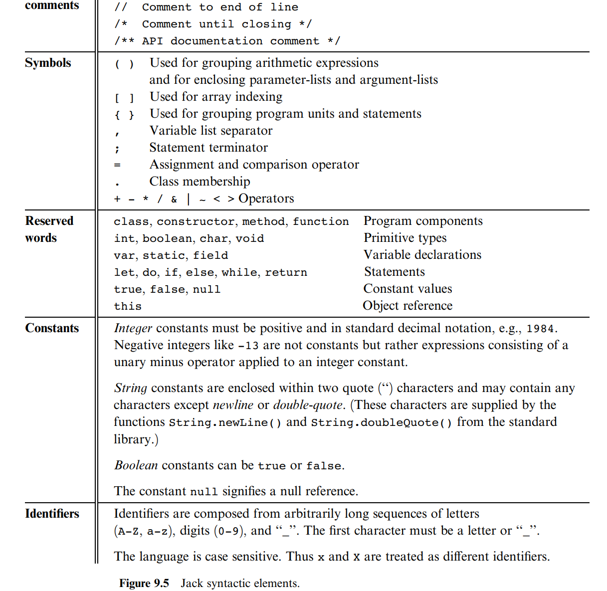
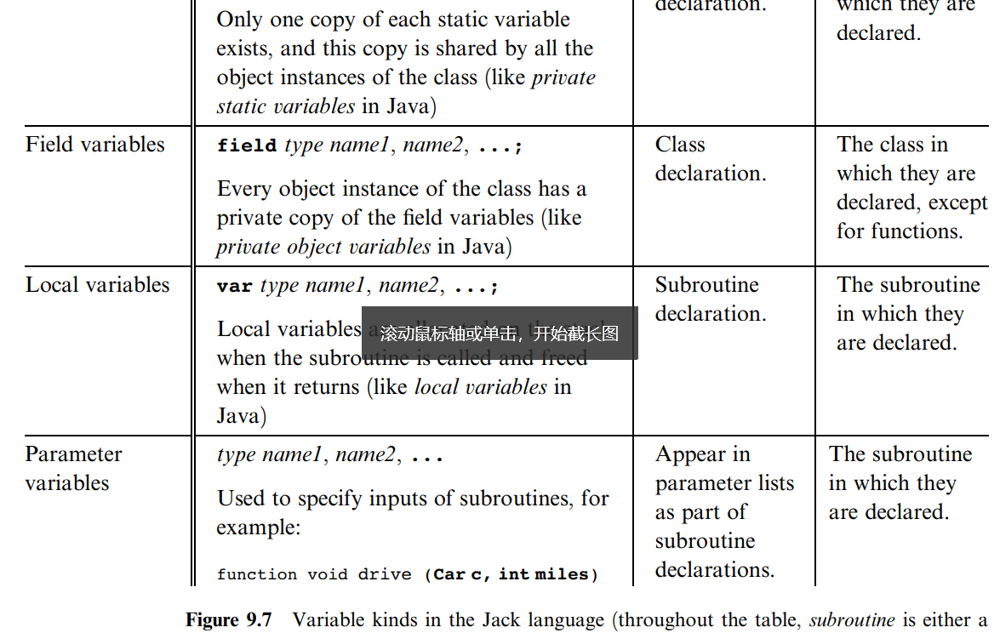
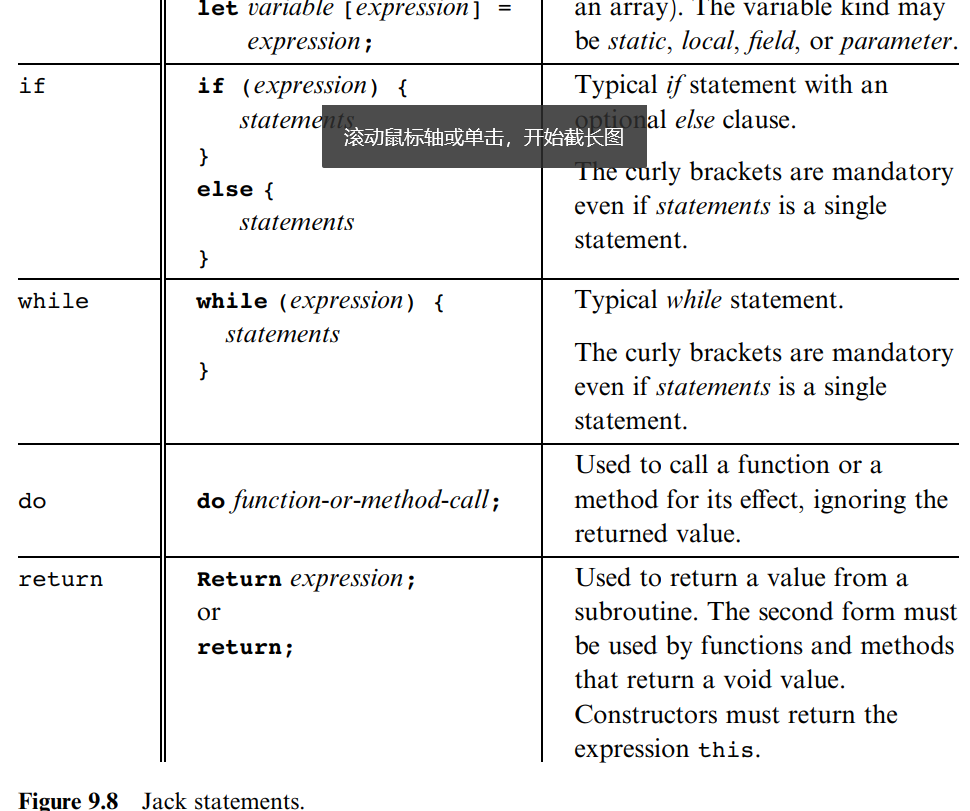
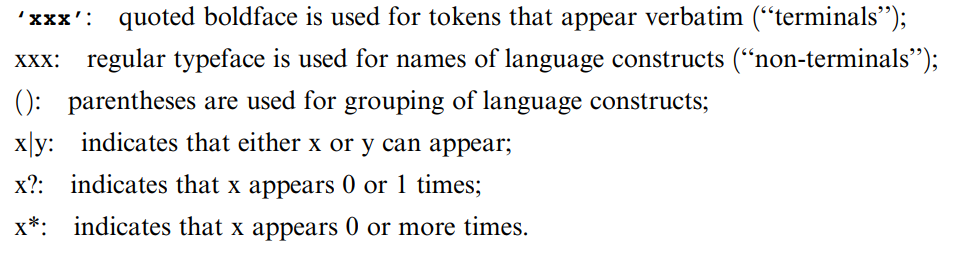
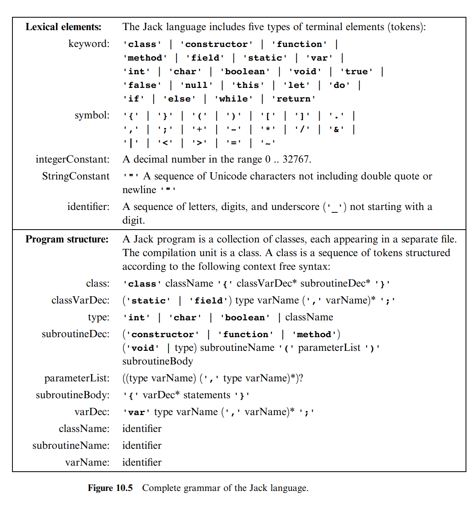

# Project 10-11 说明

- [Project 10-11 说明](#project-10-11-说明)
    - [Jack 语言](#jack-语言)
        - [Jack 语言简介](#jack-语言简介)
        - [Jack 语言规范](#jack-语言规范)
            - [语言相关元素](#语言相关元素)
            - [程序结构](#程序结构)
            - [变量](#变量)
            - [语句](#语句)
            - [表达式](#表达式)
            - [函数调用](#函数调用)
            - [构造函数和析构函数](#构造函数和析构函数)
            - [Jack 标准库](#jack-标准库)
    - [语法分析](#语法分析)
    - [输入](#输入)
    - [输出](#输出)
        - [终结符](#终结符)
        - [非终结符](#非终结符)

## Jack 语言

### Jack 语言简介

1. 每个 project 必须有一个`class Main`，其中必须有一个`main`函数，用`function void main()`来定义
2. Jack 支持数组`Array`，使用方法如下：

   ```Jack
   // 类型声明
    var Array a;
    var int i,length,sum;

    // 类型定义
    let length = Keyboard.readInt("How many numbers?");
    let a = Array.new(length);
    let i = 0;
    let sum = 0;

    // 使用循环求值
    while(i < length) {
        let a[i] = Keyboard.readInt("Enter the next number:");
        let sum = sum + a[i];
        let i = i + 1;
    }

    // 打印
    do Output.printString("The sum equals");
    do Output.printInt(sum/length);
    do Output.println();
    return;
   ```

3. Jack 支持 3 种基础数据类型：
    - int
    - char
    - boolean
4. Jack 支持类的定义和实现
   ```Jack
   class Rational {
        field int numer,denom;
        constructor Rational new(int a,int b) {
            let numer = a;
            let denom = b;
            do reduce();
            return this;
        }
        method int getNumer() {}
        method int getDenom() {}
        method Rational Plus(Rational Other) {}
        method void print() {}
   };
   ```
5. 函数调用
    - 使用`do Class.function_name()`来调用一个普通函数
    - 使用`do object.function_name()`来调用一个 method
6. 可以使用`if`进行条件判断

### Jack 语言规范

#### 语言相关元素

- symbols
- reserved words
- constants
- identifiers

  

#### 程序结构

```jack
class name {
    field/static variable;
    [constructor/function/method] [return-type] [name] ([param-list]) {
        local variable declarations;
        statement;
    }

}
```

此外，如前文所写，一个 Jack 程序必须有一个 Main 类，其中有一个 main 函数。

#### 变量

变量有四种，且是弱类型：

- field，对象特有的变量
- static，整个类共享的变量
- local，局部变量
- parameter，参数变量

变量的类型有两种：

- 原始类型
    - int：16 位的补码表示
    - char：unicode 字符
    - boolean：true/false
- 对象类型：声明时存储一个空的对象引用，调用构造函数后为新创建的对象分配空间，将该引用指向该空间
    - Jack 标准库中所有
        - Array：一元数组，数组中元素的类型可以不一样。在没有用`Array.new(length)`初始化数组时，该值存储的是一个空引用
        - String：其用法如下
      ```Jack
      var String s;
      var char c;
      let s = "Hello World";
      let c = s.charAt(6);
      ```
    - 自定义的类的对象

因为是弱类型，所以可以进行类型转换，转换有如下几种规则：

- `char`和`int`可以互转
- 一个整数可以被赋给一个引用类型，赋值之后作为该引用类型的地址，譬如：
  ```jack
  var Array a;
  let a = 5000;
  a[100] = 77; 这里M[5100] = 77
  ```
- 数组的值可以作为构造函数的传参，譬如：
  ```jack
  var Complex c;
  var Array a;
  let a = Array.new(2);
  let a[0] = 7;
  let a[1] = 8;
  let c = a; // c = Complex(7,8)
  ```

各个类型的作用域如下：



#### 语句

Jack 语言的几种语句形式如下：



#### 表达式

> Jack 语言无符号优先级的说法，因此必须使用括号来表达优先级

- 常数
- 变量名
- this
- 数组索引：如`name[expression]`
- 过程调用（返回非 void）
- 一元运算：以`-[variable]`或者`~[variable]`开头的表达式
    - `-`开头：对值取负
    - `~`开头：对值取反
- 二元运算：`+ - * / & | > < =`（注意不是`==`）
- `()`：括号内的表达式

#### 函数调用

形式：`[method/function_name](argument_list)`

1. 对于静态方法：无论在类的内外部都需要使用全名进行调用，如`className.function(args)`
2. 对于非静态方法：

- 类内部：`method(args)`
- 类外部：`object_name.method(args)`

#### 构造函数和析构函数

- 使用`className.new(args)`来调用构造函数
- 使用`dispose()`来调用析构函数，每个析构函数使用`Memory`库中的`Memory.deAlloc(object)`来进行析构

#### Jack 标准库

Jack 有 8 个标准库，分别是：

- Math
- String
- Array
- Output
- Screen
- Keyboard
- Memory
- Sys

## 语法分析

语法规则的表示方法：



语法规则如下：



.png>)

## 输入

程序运行方式如下：

```bash
./JackAnalyzer [filename.jack/directory]
```

程序为每个`.jack`文件输出一个`.xml`文件。

其中，无需进行词法分析的符号包括：

- 空格
- 换行
- 注释
  ```
  /* comment until closing */
  /** API
  comment */
  // comment to end of line
  ```

## 输出

### 终结符

- keyword, symbol, integerConstant, stringConstant, or identifier

### 非终结符

- class, classVarDec, subroutineDec, parameterList, subroutineBody, varDec;
- statements, whileSatement, ifStatement, returnStatement, letStatement, doStatement;
- expression, term, expressionList.

## 测试程序

两个输出测试文件：

- xxxT.xml
- xxx.xml

3个测试程序：

- Square
- ExpressionlessSquare
- ArrayTest

## 注意

1. `.xml`文件中的`string`没有`""`
2. `.xml`文件中的`<, >, ", &`，应该用`&lt; &gt; &quot; &amp;`表示

## 测试方法

- [x] 实现词法分析程序，使用`TextComparator`比较`xxxT.xml`的结果（词法分析）
- [ ] 实现语法分析程序，先不对`expression`进行语法分析，使用`ExpressionlessSquare`来进行测试
- [ ] 完善语法分析程序，对`expression`进行语法分析，使用`Square`和`ArrayTest`来进行测试

## 词法分析时的算法

要注意的是，词法分析时，有几个值需要重点挑出来，他们具有较高的优先级：

1. keyword
2. symbol

其中，keyword的优先级可以通过将其放在`identifier`和`string constant`前面进行判断来实现， 但是`symbol`不行，因为他可能跟在其他的后面，所以我们在执行的时候，应该首先根据`symbol`
把一个`word`断成几段， 对每段进行判断，将判断的结果压在一个`list`中。最后输出这个`list`。

## 语法分析

要检查的内容包括（2.30之前完成）：

1. 每个输出之前的缩进实现
2. 各个compile语句的逻辑，是否已经完全走完了所有的终结符和非终结符
3. 各个compile语句的返回值，到底是返回-1，还是`exit(1)`
4. 是否实现了完善的回溯机制
5. 各个compile语句什么时候打印<非终结符>xxx</非终结符>(只有非终结符需要tag和closetag，其他的不需要)
6. `compile_term()`中的`LR(1)`语法分析是否实现完全

Todo:

1. 测试
2. Codegen完成
3. OS部分完成
4. CS61A完成
5. Python实现Scheme解释器
6. MIT 6.037完成
7. Scheme实现Scheme解释器
8. SICP阅读
9. Jack语言实现Scheme解释器
10. 15-213完成
11. 其他系统入门课程完成

- [ ] subroutine_dec
- [x] parameter_list
- [x] subroutine_body
- [ ] var_dec
- [ ] class_name
- [ ] subroutine_name
- [ ] varName
- [x] statements
- [ ] statement
- [ ] letStatement
- [ ] ifStatement
- [ ] whileStatement
- [ ] doStatement
- [ ] returnStatement
- [x] expression
- [ ] term
- [x] subroutine_call
- [x] expression_list
- [ ] op
- [ ] unary_op
- [ ] keyword_constant

# Compiler Engine异常情况

1. `compile_if()`中有else，else没打出来
2. `compile_do()`中`()`中没有`expression`的情况没打出来(`do draw();`还有`do moveSquare();`)

# Todo

- [ ] Constructor 写法
- [ ] function 写法
- [ ] method 写法
- [ ] return type 写法
- [ ] subroutine_name 写法
- [ ] parameter_list 写法
- [ ] subroutine_body